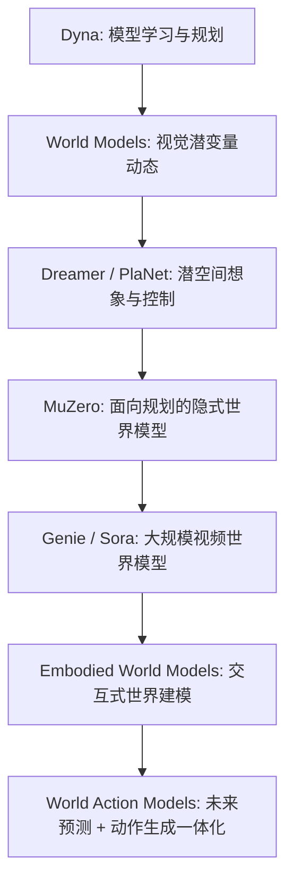
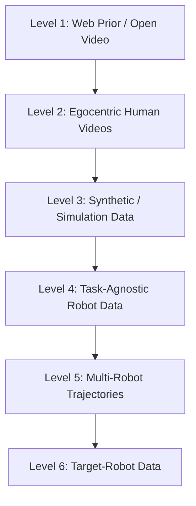
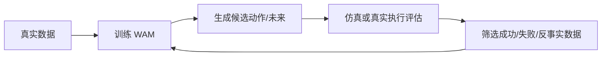

> [!abstract] 摘要
> 世界模型（World Model, WM）的核心目标是学习环境动态，使智能体能够在内部模型中预测、规划和行动。过去三十多年，WM 经历了从 Dyna 式模型学习、深度潜变量世界模型、Dreamer/MuZero 式强化学习落地，到 Genie、Sora 等大规模视频世界模型的多次范式转向。然而，具身智能任务暴露出一个根本矛盾：**能够预测未来的模型并不必然能够产生可执行动作**。视觉语言动作模型（Vision-Language-Action Model, VLA）虽然强化了语言指令到动作的映射，但多数 VLA 仍偏向反应式策略，没有把未来物理演化内生化。世界动作模型（World Action Model, WAM）正是在这一背景下出现：它试图在同一框架中联合建模未来状态与可执行动作，使“看见—预测—校验—行动”成为统一的生成与决策过程。本文在梳理 WM 技术谱系的基础上，严格区分 WM、动作条件世界模型（Action-Conditioned World Model, AC-WM）、VLA 与 WAM 的概念边界，并重点围绕 WAM 的训练数据体系展开分析。核心结论是：WAM 的真正瓶颈并不只是模型规模，而是数据规模、数据质量、模态对齐、跨本体迁移与可执行性评估之间的系统性矛盾。未来 WAM 研究很可能从“更大的视频生成器”转向“更好的视觉—动作 token 空间、更高质量的数据混合策略，以及可闭环自举的数据系统”。

> [!note] 阅读说明
> 本文是两份深度研究报告的融合版。原报告中的 ChatGPT 内部引用标记已全部删除，改为普通 Markdown 可读的参考文献编号，例如 `[1]`、`[15]`。文末 `References` 部分给出核心论文与数据集来源，便于在 Obsidian、GitHub Pages 或 PDF 导出中正常显示。

---

## 0. 问题意识：为什么 WAM 值得单独讨论？

世界模型不是一个新概念。早在 Sutton 的 Dyna 架构中，强化学习就已经把“学习环境模型—在模型中规划—再回到真实环境执行”看作一个统一闭环 [1]。2018 年 Ha 与 Schmidhuber 的 *World Models* 让这个思想进入深度学习时代：智能体先用 VAE 压缩视觉观测，再用循环模型预测潜在动态，最后在“梦境”中训练控制器 [2]。随后 PlaNet、Dreamer、DreamerV2、DreamerV3 把潜变量世界模型推向像素级控制和多任务强化学习 [3-6]；MuZero 则证明，不必重建完整观测，只要学习对规划有用的隐式模型，也能在围棋、国际象棋、将棋和 Atari 上取得强性能 [7]。

但当研究对象从游戏环境转向真实机器人时，纯 WM 和纯 VLA 都遇到了结构性瓶颈。

纯 WM 通常学习：

$$
p_\theta(o_{t+1:t+H}\mid o_{\le t}, a_{t:t+H-1}),
$$

也就是在给定历史观测和动作条件下预测未来。它回答的是“如果我这样做，会发生什么”。问题是，它本身未必回答“我现在应该怎么做”。

纯 VLA 通常学习：

$$
\pi_\phi(a_{t:t+K-1}\mid o_t, l),
$$

也就是根据当前观测和语言指令输出动作。它回答的是“看见这个画面和指令，应该输出什么动作”。问题是，它可能只是学到分布内的图像到动作映射，而没有显式理解动作会如何改变未来状态。

WAM 的目标则更接近：

$$
p_\psi(o_{t+1:t+H}, a_{t:t+K-1}\mid o_{\le t}, l).
$$

它把未来状态和动作放进同一个联合建模目标中。一个理想的 WAM 不只是会“想象未来”，也不只是会“输出动作”，而是能够让未来预测与动作生成互相约束：动作必须能导致合理未来，未来也必须能反向校验动作是否可执行。

这就是 WAM 值得单独讨论的原因：它不是 WM 的简单动作条件化，也不是 VLA 的辅助视频头，而是试图把**世界预测与动作决策耦合成一个具身基础模型**。

---

## 1. 世界模型的发展脉络

### 1.1 理论奠基期：Dyna 与模型学习的闭环思想

Dyna 架构的历史意义在于，它不是把模型学习看作额外模块，而是把学习、规划和执行放进同一个强化学习闭环 [1]。智能体一方面从真实环境中收集经验，另一方面学习一个内部模型，并在该模型中生成模拟经验，用于更新策略或价值函数。这个阶段的局限也很明显：模型容量有限，环境多为低维状态空间，难以处理高维视觉、复杂接触动力学和长时序任务。

### 1.2 深度学习启动期：从像素到潜空间

2018 年 *World Models* 将世界模型带入深度学习语境 [2]。其基本范式是：

1. 用 VAE 将图像压缩为潜变量；
2. 用 MDN-RNN 建模潜在动态；
3. 用简单控制器在潜空间中做决策。

PlaNet 进一步提出 latent dynamics planning，从像素观测中学习潜变量模型并用于规划 [3]。这一阶段的关键突破是：世界模型不再局限于低维状态，而可以从原始视觉输入中学习动态表示。但当时的模型与策略仍相对松耦合，真实机器人任务中的泛化能力有限。

### 1.3 强化学习落地期：Dreamer 与 MuZero

Dreamer 系列通过 Recurrent State-Space Model（RSSM）在潜空间中想象轨迹，并直接基于 imagined trajectories 优化 actor-critic [4-6]。它把“世界模型能否帮助决策”从概念推进到可扩展算法。DreamerV3 进一步强调跨任务、跨领域的统一世界模型强化学习框架 [6]。

MuZero 则走了另一条路线：它不学习完整环境重建，而只学习与规划相关的隐式状态、奖励和价值 [7]。这说明世界模型的目标不必是“逼真地复原世界”，而可以是“学习对决策足够有用的模型”。这对后来的 WAM 非常重要，因为 WAM 同样开始质疑：高保真视频生成是否一定是控制最需要的能力？

### 1.4 视频生成爆发期：Genie、Sora 与大规模视频世界模型

2024 年后，Genie、Genie 2/3、Sora 等大规模视频生成或交互式世界模型把 WM 推向“开放世界视觉预测”方向 [8-11]。这类模型显示出强大的时空一致性、物体运动建模和视觉生成能力。它们的意义在于：世界模型从强化学习中的小模型，转向了视频生成大模型时代的基础设施。

但这也引出了一个新问题：视频生成模型生成的未来，即使视觉上合理，也未必能被机器人执行。机器人控制需要动作空间、关节限制、末端执行器状态、接触动力学、时延和安全约束。纯视频模型缺少这些接口，因此“世界模拟器”与“机器人策略”之间仍有鸿沟。

### 1.5 具身交互演进期：从 WM 到 WAM

2025–2026 年，WAM 开始被系统性提出。其直接背景是：大规模视频世界模型已经证明可以学习物理变化先验，VLA 已经证明语言—视觉—动作映射可以规模化，但二者结合仍不充分。WAM 的关键主张是：未来状态预测不应该只是辅助任务，而应该成为动作生成的一部分。

下面这张图概括了范式演进：

---

## 2. 技术路线全景：五类世界模型范式

### 2.1 潜变量世界模型：RSSM / Dreamer 路线

潜变量世界模型将观测压缩为低维潜状态，并学习：

$$
p(z_{t+1}\mid z_t,a_t).
$$

代表工作包括 PlaNet、Dreamer、DreamerV2、DreamerV3 [3-6]。这一路线的优点是训练与规划效率高，适合强化学习闭环；缺点是潜变量可解释性弱，对长时复杂接触、真实机器人迁移和开放场景泛化仍有限。

### 2.2 自回归式视频世界模型：Transformer 离散令牌路线

这一类方法将图像、视频、动作离散化为 token，再用 Transformer 预测序列。WorldVLA 就属于这一路线的早期 WAM 代表，它把图像、文本和动作 token 放进统一自回归框架 [17]。优势是与 LLM 技术栈高度兼容，便于统一多模态；短板是 token 误差会随时间累积，长动作 chunk 容易出现级联偏差。

### 2.3 扩散式生成世界模型

扩散模型通过迭代去噪生成未来帧或动作轨迹。Sora、Genie、DreamZero、UWM、MotuBrain 等都与扩散或 flow matching 系谱有关 [8-11, 15, 18, 21]。它的优势是多模态生成质量高，适合表达复杂未来分布；缺点是推理慢、闭环控制成本高，而且高保真视觉并不等于高质量动作。

### 2.4 JEPA 表征预测路线

JEPA（Joint Embedding Predictive Architecture）不追求像素重建，而是在抽象表征空间预测未来 [12-13]。这种思想对 WAM 很重要，因为它把目标从“复原画面”转向“预测语义状态”。VLA-JEPA 进一步将 leakage-free state prediction 用于机器人预训练，强调人类视频对鲁棒性和扰动泛化的价值 [26]。

### 2.5 具身交互式世界模型

具身交互式世界模型把观测、动作、语言、多视角视频和机器人状态共同建模。它不再满足于预测未来，而是要求未来预测能服务于行动。WAM 正是在这一方向上继续推进，将未来状态预测和动作输出放进统一策略框架。

---

## 3. WAM 的概念边界：WM、AC-WM、VLA 与 WAM

### 3.1 动作条件世界模型不是 WAM

动作条件世界模型（AC-WM）学习：

$$
p(o_{t+1:t+H}\mid o_{\le t},a_{t:t+H-1}).
$$

它的动作是输入条件，不是模型要生成的策略输出。一个 AC-WM 可以作为规划器、模拟器或评估器，但如果它本身不输出可执行动作，就不应被称为严格意义上的 WAM。

### 3.2 VLA 也不是 WAM

VLA 学习语言与视觉条件下的动作分布：

$$
p(a_{t:t+K-1}\mid o_t,l).
$$

VLA 的优势是语言泛化和指令理解，但多数 VLA 是反应式策略。即便加入辅助 future prediction loss，如果未来预测不参与策略主体，也更应称为带世界模型辅助损失的 VLA，而不是 WAM。

### 3.3 WAM 的严格定义

本文采用较严格的定义：

> WAM 是一种具身策略模型，它在同一框架中耦合前向未来状态预测与可执行动作生成，目标是学习未来状态与动作的联合分布，并使二者在训练或推理中互相约束。

形式上：

$$
p_\psi(o_{t+1:t+H},a_{t:t+K-1}\mid o_{\le t},l).
$$

其中：

- \(o_{\le t}\)：历史观测，可以是 RGB、RGB-D、多视角视频、proprioception 等；
- \(l\)：语言指令或任务条件；
- \(o_{t+1:t+H}\)：未来视觉或状态；
- \(a_{t:t+K-1}\)：未来动作 chunk；
- \(H\) 和 \(K\)：未来预测与动作输出的时间跨度。

### 3.4 级联式 WAM 与联合式 WAM

WAM 可以分为两类：

| 路线 | 基本思想 | 优点 | 短板 | 代表性工作 |
|---|---|---|---|---|
| 级联式 WAM / 前驱 | 先生成未来计划、latent action 或视频表征，再由动作模块输出动作 | 模块清晰，便于利用无动作视频 | 计划—动作接口可能成为瓶颈，存在级联误差 | VPP、LAWM、CoLA-World |
| 联合式 WAM | 在同一骨干中同步预测未来与动作 | 耦合紧，动作与未来可互相校验 | 训练更难，数据要求更高，推理更重 | DreamZero、UWM、WorldVLA、LingBot-VA、MotuBrain、RepWAM、Fast-WAM、τ₀-WM |

---

## 4. 代表性 WAM 工作：从结构原型到数据范式

### 4.1 Video Prediction Policy：数据先驱而非严格 WAM

Video Prediction Policy（VPP）不是严格意义上的联合式 WAM，但它对后续 WAM 的意义很大：它证明大规模视频预测模型中的中间表征可以显著改善控制 [23]。

VPP 的数据配方非常清楚：

- Something-Something-v2 人类操控视频：191,642 条；
- RT-1、Bridge、BC-Z、Taco-Play、Jaco-Play、CALVIN、MetaWorld 等互联网/机器人轨迹：179,074 条；
- Panda 自采轨迹：2,000 条；
- 灵巧手轨迹：2,476 条；
- 总计约 375,192 条数据。

消融结果显示，去掉 Internet manipulation data 后，CALVIN 平均长度从 4.29 降到 3.97；再去掉 SVD 预训练后进一步降到 1.63。这说明无标签或弱标签视频的价值，首先体现在把视觉编码器训练到理解物体运动和操作动态，而不是直接替代动作监督。

### 4.2 Unified World Models：动作轨迹与无动作视频的统一扩散框架

Unified World Models（UWM）是较早明确把有动作机器人轨迹和无动作视频放入同一扩散框架的工作 [18]。它在统一 Transformer 中耦合视频扩散与动作扩散，并为不同模态设置独立 diffusion timestep，使一个模型可以切换为 policy、forward dynamics、inverse dynamics 或 video generator。

其数据设置具有代表性：

- 真实机器人部分：从 DROID 抽取 2,000 条带动作轨迹做预训练，同时抽取 2,000 条无动作视频做 co-training；
- 仿真部分：使用 LIBERO-90 的 4,500 条轨迹预训练，再在 5 个 LIBERO-10 任务上各用 50 条专家演示微调；
- 额外测试 Kinetics-400 和 Something-Something-v2 等人类视频。

UWM 的关键结论是：动作自由视频可以被纳入策略预训练，但需要在训练目标上允许缺失动作样本进入，而不是强制所有数据都具备动作标签。换言之，WAM 的数据系统必须支持异质监督。

### 4.3 DyWA：动力学自适应的专项 WAM

DyWA 面向 non-prehensile manipulation，即推、拨、滑动等非抓取操作 [19]。这类任务对摩擦、质量、接触和恢复系数极其敏感，单帧视觉策略很容易失败。

DyWA 采用 teacher-student 框架：

- teacher policy 在模拟器中通过 PPO 训练 200K iterations；
- student 通过 DAgger 蒸馏 500K iterations；
- 训练中随机化物体质量、尺度、摩擦系数，以及物体、桌面和夹爪的恢复系数。

模型不只是输出动作，还预测未来任务状态，并用 dynamics adaptation module 从历史 observation-action 中估计动力学变化。实验中，DyWA 在单视角点云设置下较基线提升 31.5%，真实世界平均成功率约 68%。它说明：对接触密集任务，数据的关键不是越多越好，而是必须覆盖动力学变化空间。

### 4.4 WorldVLA：离散自回归式 action-world model

WorldVLA 将图像、文本和动作统一 token 化，放进同一个自回归模型中 [17]。世界模型分支预测下一帧，动作模型分支预测下一段动作，并通过 action attention mask 抑制动作 chunk 自回归误差传播。

WorldVLA 的数据设置相对干净，主要围绕 LIBERO 展开：

- 过滤失败轨迹与 no-op 动作；
- 采用 90/10 train-val 划分；
- 覆盖 LIBERO-Spatial、Object、Goal、Long；
- 使用 LIBERO-90 作为预训练来源。

它的实验显示，世界模型分支可将长序列视频 FVD 从 718.6 降到 674.1。WorldVLA 的价值在于结构原型清晰，但其数据外延有限，几乎没有解决真实多源异构、跨机器人和无动作视频问题。

### 4.5 LAWM：无动作视频是否能用于动作学习？

LAWM 的重要性在于，它直接回答“无动作视频能否替代动作标注预训练”这一问题 [24]。其做法是先让 imitation model 预测 latent actions，再将 latent actions 输入 DreamerV3 风格 RSSM 做逐步 next-frame prediction。预训练阶段不需要真实动作监督，微调阶段再将 latent action head 重置为真实动作空间。

数据方面：

- BridgeData V2：60,096 条轨迹；
- Something-Something-v2：220,847 条视频；
- 下游微调：LIBERO-90 和真实机器人任务。

结果显示：

| 设置 | BAKU / LIBERO-90 | Diffusion Policy / LIBERO-90 |
|---|---:|---:|
| Scratch | 91.4 | 85.7 |
| Supervised Pretrain | 92.7 | 91.9 |
| World-Model Pretrain | 93.7 | 93.0 |

真实世界中，平均成功率从只用自采任务数据的 84% 提升到加入 Something-Something-v2 世界模型预训练后的 94%。它说明：在某些场景下，学习状态转移可能比学习原数据集动作标签更泛化，因为动作标签会绑定特定机器人、本体和控制频率。

### 4.6 Motus / MotuBrain：六层数据金字塔与统一 WAM 底座

Motus 与 MotuBrain 系列的重要性在于，它们把 WAM 从“模型结构”推向“数据系统工程” [21-22]。其核心思想是构建 embodied data pyramid：

这一金字塔的意义在于，不同数据层承担不同先验：

- Web video 提供开放世界视觉与动态先验；
- 第一视角人类视频提供操作过程和长时行为；
- 仿真数据提供密集状态、可控扰动和低成本扩展；
- task-agnostic 数据提供本体运动覆盖；
- multi-robot trajectories 提供跨本体泛化；
- target-robot data 用于最终动作接口校准。

报告中记录的 Motus 数据规模包括：

| 数据来源 | 数量 |
|---|---:|
| EgoDex | 230,949 |
| AgiBot | 728,209 |
| RDT | 6,083 |
| RoboMind Franka | 9,589 |
| RoboMind Aloha | 7,272 |
| RoboTwin | 27,500 |
| Task-Agnostic | 1,000 |
| In-house | 2,000 |

MotuBrain 进一步在 UniDiffuser 风格框架下结合 video generation expert、action expert 和 understanding expert，支持 policy、world modeling、inverse dynamics、joint video-action prediction 等能力，并报告了 RoboTwin 2.0 clean/randomized 平均成功率 95.8%/96.1%、最高 11Hz 推理和约 50x 工程加速 [21]。这类工作的核心启示是：WAM 的可扩展性并不只取决于模型大小，更取决于能否把多层数据放入明确的训练阶段。

### 4.7 DreamZero：WAM 作为 zero-shot policy

DreamZero 是目前 WAM 范式中最具有里程碑意义的工作之一 [15]。它证明：当视频扩散骨干足够强，并且动作与未来视频真正联合建模后，WAM 本身可以直接作为 zero-shot policy。

其数据论证非常关键：

- AgiBot G1 自采约 500 小时 teleoperation；
- 覆盖 22 个真实环境；
- 约 7.2K episodes；
- 每段平均约 4.4 分钟；
- 平均包含约 42 个 subtasks；
- 仅改变数据多样性而不增加总时长，简单 pick-and-place generalization 从 33% 提升到 50%；
- 12 分钟人类视频或 20 分钟其他机器人视频，可使目标机器人在 unseen tasks 上获得超过 42% 的相对提升；
- 新本体 YAM 上只需 30 分钟、55 条轨迹、11 个任务的 play data，即可进行 few-shot embodiment adaptation；
- 系统优化后可达到约 7Hz 闭环控制。

DreamZero 的核心结论是：WAM 数据的关键不是“同一任务反复示范”，而是“长时程、多样化、真实有用行为”能否形成可迁移视觉—动作因果先验。

### 4.8 VLA-JEPA：人类视频究竟补足什么？

VLA-JEPA 不是最严格的联合生成式 WAM，但它对“如何利用人类视频”这一问题很重要 [26]。它采用 leakage-free state prediction：未来帧只作为 JEPA 目标出现，不进入当前观测侧输入，避免 latent action 退化为未来帧压缩码。

其训练数据包括：

- 约 220K human videos；
- DROID 76K trajectories；
- 联合预训练 50K steps；
- 下游 LIBERO / LIBERO-Plus 使用约 2K 专家演示；
- 真实世界 3 个任务共 100 条示范。

VLA-JEPA 的结论比较细：人类视频不一定最显著提升 ID 场景性能，也未必直接弥合 real-to-sim gap；但对 LIBERO-Plus 这类扰动鲁棒性测试很有帮助。换言之，人类视频更像是在补充稳定性、抗干扰性和重复尝试策略，而不是直接提供低层机器人动力学。

### 4.9 Fast-WAM：测试时真的需要想象未来吗？

Fast-WAM 提出了一个非常关键的问题：WAM 的收益到底来自测试时显式生成未来，还是来自训练时视频目标塑造表征？[20]

它的实验设计干净：

- LIBERO 四个 suite，每个 suite 500 demonstrations；
- RoboTwin 使用 2,500 clean + 25,000 randomized demonstrations；
- 真实世界 towel-folding 使用 60 小时 teleoperation 数据；
- 比较 Fast-WAM、Fast-WAM-Joint、Fast-WAM-IDM 以及去掉 video co-training 的版本。

结果表明：

| 设置 | RoboTwin | LIBERO |
|---|---:|---:|
| Fast-WAM | 91.8% | 97.6% |
| w/o video co-training | 83.8% | 93.5% |

真实世界中，去掉 video co-training 后成功率可降到 10%。同时，Fast-WAM 将延迟做到约 190ms，而 imagine-then-execute 变体可慢至约 810ms。

这说明：视频监督的主要价值可能不是上线时“真的生成未来画面”，而是离线训练时把状态表征塑造成 world-grounded representation。

### 4.10 RepWAM：从视频生成器转向视觉—动作 token 空间

RepWAM 的研究重心不是更大的视频模型，而是更合适的视觉—动作表示 [16]。它指出，现有 WAM 常沿用重建导向的视频 tokenizer，导致视觉 token 过度关注纹理、背景和外观，而不是物体身份、关系和交互。

RepWAM 提出 RepViTok：

1. 用冻结视觉基础模型约束视频自编码器，使 latent 同时具备像素重建能力与语义对齐能力；
2. 在语义视觉 latent 上学习 latent action tokenizer；
3. 用 causal diffusion transformer 以 chunk 方式联合生成视觉 token 与 action token。

数据方面：

- RepViTok 在 Panda-70M 上训练；Panda-70M 包含约 70.7M video-caption pairs 和约 167K 小时视频；
- WAM 预训练使用 AgiBot；
- 本体适配混合 AgiBot、RoboMIND、RoboCOIN、InternA1；
- 真实世界三任务上每任务 50 demos，微调 500 steps；
- RoboTwin 2.0 上报告 Easy 89.3 / Hard 88.4。

RepWAM 的核心启示是：WAM 的数据瓶颈不只是“数据少”，还包括“数据被什么表示空间承载”。如果 tokenizer 不适合控制，增加数据也可能只是强化错误的视觉偏好。

### 4.11 Efficient-WAM：效率与数据使用方式

Efficient-WAM 的意义在于说明：如果模型结构更高效，对数据的使用方式也会改变 [27]。它从 WAN-2.2-5B 蒸馏出 compact video expert，并结合 token-sparse future latents 与 asymmetric video-action denoising，使视频分支只保留动作需要的几何、动态和接触线索。

其训练与评测设置包括：

- RoboTwin 2.0：2,500 clean + 25,000 randomized demonstrations；
- Astribot S1：4 个真实任务，每任务 100 条 human demonstrations；
- RoboTwin 上 1B 模型达到 86.7% / 85.7%；
- 真实机器人平均成功率 66.25%；
- chunk latency 约 98ms，相比 Motus 的约 3215ms 有明显优势。

它的启示是：如果未来视频只是动作生成的条件信号，那么数据和模型都应围绕“动作判别有效性”优化，而不是一味追求像素逼真度。

### 4.12 τ₀-WM 与 CoLA-World：边界案例与下一步形态

τ₀-WM 将 policy learning、video prediction 和 action evaluation 纳入统一 future-predictive 框架 [28]。其数据规模达到约 27.3K 小时，包括：

- 17.8K 小时真实机器人遥操作；
- 6.5K 小时过滤过的 UMI 风格开放演示；
- 3.0K 小时开放第一视角人类交互视频。

它通过 supervision mask 允许 video-only、robot trajectories 和 failure trajectories 混合训练，并将 progress/failure 监督纳入模型。结果中，Pen-to-holder 的 clean/clutter 从 0.22/0.06 提升到 0.56/0.53，Object-wipe-place 从 0.85/0.55 提升到 0.90/0.75。

CoLA-World 则更接近 latent-action world model 与 WAM 的边界案例 [29]。它针对两阶段“先学 latent action model，再学 world model”的表示冻结问题，提出 LAM 与 world model 的共同演化。它未必直接输出 robot-native low-level action，但对“latent action 能否成为 WAM 的中间语法”非常有启发。

---

## 5. WAM 训练数据体系：核心瓶颈

### 5.1 为什么 WAM 的数据需求更苛刻？

WAM 的训练数据比纯 WM 或纯 VLA 更难，根本原因在于它同时要求三件事成立：

1. 未来状态预测要真实；
2. 动作输出要可执行；
3. 未来状态与动作必须在同一时间轴和语义坐标系中对齐。

纯 WM 可以容忍动作只是条件变量，纯 VLA 可以在分布内凭图像—动作相关性工作，而 WAM 要学习的是未来与动作的联合分布。一旦动作时间戳偏移、相机标定不准、语言指令粒度太粗、轨迹中存在未标注失败，模型就可能把错误的视觉变化与动作绑定起来，形成系统性偏差。

### 5.2 四类核心数据源

| 数据来源 | 核心作用 | 数据形态 | 标注质量 | 成本 | 适合阶段 | 主要短板 |
|---|---|---|---|---|---|---|
| 真实机器人遥操作数据 | 提供最可信的动作监督与本体可执行接口 | 多视角 RGB/RGB-D、proprio、控制命令、语言 | 高 | 最高 | SFT、action decoder 校准、真实部署 | 贵、慢、场景窄 |
| 便携式人类演示数据 | 扩展真实场景和长时行为 | 第一视角视频、手部轨迹、语音/文本 | 中到高 | 中 | 预训练、human-to-robot bridge | embodiment gap 大 |
| 仿真环境生成数据 | 提供可控 physics 与密集状态监督 | RGB、深度、分割、物体状态、碰撞、奖励 | 高但有仿真偏差 | 低到中 | teacher policy、压力测试、消融 | sim-to-real gap |
| 无标注互联网/第一视角视频 | 提供大规模世界先验与行为多样性 | 视频、文本、弱标签 | 低到中 | 最低 | 动态预训练、latent action 学习 | 缺动作、可执行性弱 |

这四类数据不是互相替代，而是功能互补。DreamZero 用目标机器人遥操作数据做 joint video-action 目标，用人类或他机器人视频做 video-only 迁移；UWM 让无动作视频和有动作轨迹共享扩散骨干；τ₀-WM 用 supervision mask 接收不同监督等级的数据；Motus/MotuBrain 则将数据分成从 Web prior 到 target-robot data 的多层金字塔。

### 5.3 主流公开数据集对比

| 数据集 | 类型 | 规模与采集方式 | 场景/本体 | 标注与格式 | WAM 中的价值 | 缺陷 |
|---|---|---|---|---|---|---|
| Open X-Embodiment | 跨本体机器人数据 | 1M+ real robot trajectories，22 embodiments，527 skills，由约 60 个数据集汇聚 [30] | 多种机器人本体 | 统一 gripper-frame 7D action、视觉、语言 | 跨本体预训练底座 | 频率、视角、动作语义高度异质 |
| AgiBot World / Colosseo | 大规模真实机器人数据 | >1M trajectories，217 tasks，五类真实部署场景 [31] | 家居、商超、办公、餐饮等 | 多机位、轨迹、任务文本，human-in-the-loop 质检 | DreamZero 等高质量真实预训练来源 | 新生态，外部长期验证仍少 |
| DROID | 通用真实机器人预训练 | 76K trajectories / 350h，564 scenes，86 tasks，50 collectors，跨三大洲 [32] | Franka 平台真实桌面操作 | 多视角视频、动作、语言；后续更新标定与语言 | UWM、DreamZero、VLA-JEPA 等常用 | 单平台单臂，本体覆盖有限 |
| BridgeData V2 | 真实机器人操作数据 | 60,096 trajectories，50,365 teleop + 9,731 scripted，24 environments，13 skills [33] | 厨房/桌面家居任务 | 语言、goal image、动作轨迹 | LAWM、VLA 预训练常用 | 场景和任务类型偏窄 |
| LIBERO | 仿真长期任务基准 | 130 tasks，4 个 task suites [34] | 语言条件多任务桌面操作 | 仿真观测、语言、专家演示 | Fast-WAM、WorldVLA、MotuBrain 等评测 | 仿真域，接触真实性有限 |
| CALVIN | 长时语言操控基准 | 长时语言条件 manipulation benchmark [35] | 桌面长时组合技能 | 多模态观测、语言注释 | VPP、Seer 等 predictive policy 常用 | 本体和场景较单一 |
| RLBench | 仿真任务库 | 100 unique hand-designed tasks，可生成大量 demos [36] | 桌面操作 | RGB、depth、segmentation、proprio | 数据生成、世界模型评测 | 行为分布与真实人类/机器人不同 |
| OpenVid-1M | 通用视频预训练 | >1M text-video pairs，含 OpenVidHD 子集 [37] | 开放视觉场景 | 文本—视频对，无动作 | 世界先验、视频预训练 | 缺动作和具身对齐 |
| EWK Dataset | Embodied world knowledge 语料 | 新近由 Qwen-RobotWorld 相关工作提出 [38] | 更偏 embodied world knowledge | 视觉/语言/交互知识 | 适合作为 embodied WM 语料 | 不是成熟标准机器人基准 |
| UniTraj | 通用轨迹预训练 | 面向自动驾驶/轨迹建模的统一轨迹资源 [39] | 交通参与者轨迹 | 轨迹、场景、行为标签 | 对长时轨迹统一表示有参考 | 不是标准机器人 manipulation 数据集 |

### 5.4 数据工程关键技术

#### 5.4.1 视觉—动作统一 tokenization

跨本体数据的核心问题是：不同机器人动作空间不一致。单臂、双臂、灵巧手、移动机器人和 humanoid 的动作维度、控制频率、末端执行器约束都不同。直接拼接动作向量很难形成统一语法。

现有路线包括：

- 将动作映射到末端执行器空间，如 gripper frame 7D action；
- 使用 latent action tokenizer，把动作抽象为状态跃迁 token；
- 使用视觉—动作联合 tokenizer，让动作 token 表示语义状态变化而不是具体电机命令；
- 将不同本体动作通过 retargeting 或 shared latent action space 对齐。

RepWAM 的意义正在这里：它认为 tokenizer 决定了数据能否被正确承载。若视觉 token 只关注像素重建，WAM 会学到纹理而不是控制相关语义。

#### 5.4.2 多源异构数据对齐与监督掩码

WAM 数据往往同时包含：

- video-only 数据；
- 带语言但无动作的视频；
- 有动作但无语言的机器人轨迹；
- 成功轨迹；
- 失败轨迹；
- 人类第一视角视频；
- 他机器人视频；
- 目标机器人数据。

统一这些数据的关键是 supervision mask：对于缺失动作的数据，只计算视频预测或表征预测损失；对于机器人数据，计算联合视频—动作损失；对于失败轨迹，可以额外计算 progress/failure 或 action evaluation loss。DreamZero、UWM、MotuBrain、τ₀-WM 都体现了这种“异质监督统一训练”的趋势。

#### 5.4.3 无动作视频的伪动作生成

普通视频缺少机器人动作标签。要把它变成 WAM 可用数据，常见方法包括：

1. **latent action inference**：从连续帧中学习隐动作，再用隐动作驱动世界模型；
2. **inverse dynamics model**：预测从状态 \(o_t\) 到 \(o_{t+1}\) 所需动作；
3. **hand/pose tracking**：从人类手部或身体运动估计操作轨迹；
4. **point tracking / object motion**：用关键点轨迹抽象物体运动；
5. **retargeting**：将人类动作或他机器人动作映射到目标机器人本体。

LAWM 和 VLA-JEPA 说明，无动作视频并不一定直接补足动作标签，但可以为模型提供状态转移、重复尝试、物体运动和扰动鲁棒性。

#### 5.4.4 长时序轨迹压缩与上下文组织

真实机器人任务往往是长时序、多子任务和多阶段的。DreamZero 的数据平均每段约 4.4 分钟、包含约 42 个 subtasks，这类数据不能简单按短窗口切片，否则会丢失任务结构。

有效的数据组织需要：

- 将长轨迹切分为语义子任务；
- 保留历史上下文而非只看当前帧；
- 使用 action chunk 降低控制频率压力；
- 对关键状态变化做 temporal abstraction；
- 对失败、恢复和重新尝试进行显式标注。

Fast-WAM 的结论也提醒我们：并非所有未来帧都要在测试时显式生成，但训练时的视频目标会影响表示，因此上下文组织对数据效率非常关键。

#### 5.4.5 大规模清洗、去重与质量评分

WAM 对数据质量极其敏感。常见数据问题包括：

- 动作时间戳与视频不同步；
- 多视角相机未准确标定；
- 语言指令只描述最终目标，不描述中间过程；
- 失败轨迹未标注；
- 数据中包含长时间 no-op；
- 同质化场景过多；
- 机器人控制频率和动作尺度不一致。

DROID 后续专门发布改进相机标定和更新语言标注，AgiBot World 强调 standardized collection pipeline 与 human-in-the-loop verification，这都说明“可用数据”距离“高质量 WAM 数据”仍有很大工程距离。

---

## 6. 数据效率：从稀缺动作标注到自监督闭环

### 6.1 大规模无标注视频自监督预训练

无标注视频的优势是规模大、成本低、覆盖广。它适合学习：

- 物体持续性；
- 接触前后的视觉变化；
- 手和工具的操作模式；
- 长时任务流程；
- 环境布局与变化规律。

但它的局限也明显：缺动作、缺机器人本体、缺执行约束。因此它更适合作为世界先验，而不是直接替代机器人动作数据。LAWM、VPP、VLA-JEPA 都表明，视频预训练的收益往往通过表征或状态转移间接体现。

### 6.2 跨数据集迁移与小样本本体适配

DreamZero 显示，12 分钟人类视频、20 分钟他机器人视频或 30 分钟目标本体 play data 都能带来明显迁移收益。这说明 WAM 可能存在一种从视觉—动作先验到目标本体动作接口的快速适配机制。

但这里的核心难题是 embodiment gap：同样的视觉目标，对不同机器人可能对应完全不同的动作序列。因此，未来研究需要统一动作语法，而不是只做数据堆叠。

### 6.3 逆动力学与 latent action 自监督

逆动力学模型试图从状态变化推断动作。它对于无动作视频尤其重要，因为它允许模型从普通视频中恢复某种“操作意图”或“隐动作”。CoLA-World、LAWM、VLA-JEPA 都和这一思想相关。

不过，latent action 的风险是学到“视觉变化编码”而不是“可执行动作”。因此，未来的 latent action 必须通过真实机器人执行反馈校验。

### 6.4 模型自举生成伪数据

一个自然方向是让 WAM 生成候选未来和候选动作，再由世界模型、执行器或仿真器过滤，形成闭环自举：

这种 self-improving WAM 有潜力降低真实数据成本，但也有风险：模型会放大自身偏差，生成越来越同质化的伪数据。因此必须引入多样性约束、失败数据、反事实目标和外部验证器。

---

## 7. 数据质量、偏差与评估

### 7.1 数据质量指标

WAM 数据质量不能只看数据量，应至少包括：

| 指标 | 含义 | 为什么重要 |
|---|---|---|
| Temporal Alignment Error | 视频帧与动作时间戳偏差 | 决定动作—视觉因果绑定是否正确 |
| Embodiment Coverage | 覆盖多少机器人本体和动作空间 | 决定跨本体迁移上限 |
| Task Diversity | 任务、物体、场景、子任务多样性 | 决定泛化能力 |
| Dynamics Diversity | 摩擦、质量、接触、速度、时延变化 | 决定物理鲁棒性 |
| Language Granularity | 语言是否描述中间过程 | 决定语言—动作对齐质量 |
| Failure Annotation | 是否包含失败、恢复、进度 | 决定可校验性与安全性 |
| Executability Score | 视频或轨迹是否可被目标机器人执行 | 决定视频数据是否真正有用 |

### 7.2 三重偏差：observation、embodiment、dynamics

WAM 的偏差比纯 WM 或 VLA 更复杂。它至少包含三层：

1. **Observation bias**：视角、光照、背景、遮挡分布偏移；
2. **Embodiment bias**：机器人形态、末端执行器、自由度、动作频率不同；
3. **Dynamics bias**：接触、摩擦、质量、时延、控制噪声不同。

这三类偏差会共同影响 WAM：未来预测在新视角下可能失真，动作头又会被错误未来反向牵引，最终导致控制失败。因此，WAM 的域偏移不是简单的 covariate shift，而是观测、动作和动力学联合分布的偏移。

### 7.3 为什么数据多样性比重复演示更重要？

DreamZero 的结果说明，仅仅重复同一任务并不能显著提升泛化；真正有价值的是长时程、多样化、包含丰富子任务的真实行为数据。Motus/MotuBrain 的六层数据金字塔也说明，数据应按功能分层，而不是只统计总量。Fast-WAM 进一步说明，视频目标的作用可能更多在训练期塑造表征，而不是推理期显式生成未来。

归纳来说，WAM 数据的目标不是“更多轨迹”，而是：

> 用最少的高质量动作监督，激活最大规模的视觉动态先验，并把二者对齐到可执行动作空间。

---

## 8. 从数据视角重新理解 WAM

如果只看模型结构，WAM 似乎是“世界模型 + 动作头”。但从数据视角看，WAM 是一个更复杂的系统：

1. 它需要从 Web 视频中学习世界先验；
2. 从人类第一视角视频中学习操作过程；
3. 从仿真中学习可控扰动和密集状态；
4. 从跨本体机器人数据中学习动作抽象；
5. 从目标机器人数据中校准执行接口；
6. 从失败与进度数据中学习可校验性；
7. 从自举闭环中不断补充稀有状态。

这意味着 WAM 的竞争将逐渐从“谁的模型更大”转向“谁的数据系统更强”。未来真正强的 WAM 可能不是单一模型，而是包含数据采集、数据清洗、动作语法、视频预训练、真实执行反馈和自我改进循环的一整套基础设施。

---

## 9. 开放问题与未来研究方向

### 9.1 统一视觉—动作—语言语法

目前仍没有一种 action tokenization 能同时兼容单臂、双臂、灵巧手、移动体和 humanoid。未来需要一种类似语言 token 的统一动作语法，使不同本体的数据能够进入同一个可迁移表示空间。

### 9.2 Video-only WAM：如何稳定利用无动作视频？

无动作视频规模最大，但可执行性最低。关键问题不是“能否使用视频”，而是“如何判断一段视频对动作学习是否有用”。未来需要 executability-aware video filtering、latent action validation 和 human-to-robot retargeting。

### 9.3 数据混合律：mixture law 而不是数据集排行榜

当前很多工作报告“用了哪些数据”，但很少系统回答不同数据源的比例、顺序和监督掩码如何影响 WAM。未来需要研究 embodied data mixture law：Web video、人类视频、仿真数据、多机器人数据、目标机器人数据应该如何配比。

### 9.4 失败、进度与反事实数据

多数机器人数据集偏向成功轨迹，但真实策略需要知道“什么会失败”。τ₀-WM 已经开始纳入 progress/failure 监督。未来 WAM 应更系统地利用失败轨迹、恢复轨迹和反事实未来，用于动作评估和安全控制。

### 9.5 自我改进的闭环 WAM

WAM 最有前景的方向是自举式数据闭环：模型生成候选动作，执行器验证，失败样本回流，模型再训练。难点在于如何避免偏差放大，并确保生成数据覆盖真实世界长尾状态。

---

## 10. 结论

WAM 的出现不是偶然，而是 WM、视频生成模型和 VLA 在具身智能中相互碰撞后的必然结果。纯 WM 擅长预测但未必能行动；纯 VLA 擅长指令到动作但未必理解未来；WAM 则试图把未来预测和动作生成纳入同一个联合分布。

从目前代表性工作看，WAM 的技术路线正在经历三个变化：

1. 从级联式 future-plan-to-action 转向联合式 video-action modeling；
2. 从追求高保真未来视频转向追求控制相关动态表征；
3. 从模型结构竞争转向数据体系、token 空间和跨本体迁移竞争。

其中，训练数据是最核心的瓶颈。真实机器人数据昂贵但必要；人类视频廉价但存在 embodiment gap；仿真数据可控但有 sim-to-real gap；互联网视频规模巨大但缺动作和可执行性。未来 WAM 的关键问题，是如何把这些异构数据组织为一个统一、可校验、可迁移的训练体系。

因此，WAM 的下一阶段突破很可能不来自单一算法，而来自三者的结合：

- 更合适的视觉—动作表示；
- 更科学的数据混合与质量评估；
- 更强的真实执行反馈闭环。

如果说大语言模型的核心资产是文本与人类反馈，那么 WAM 的核心资产将是**对齐良好的世界—动作数据**。

---

## References

[1] Sutton, R. S. *Integrated Architectures for Learning, Planning, and Reacting Based on Approximating Dynamic Programming*. ICML, 1990.

[2] Ha, D., Schmidhuber, J. *World Models*. arXiv:1803.10122, 2018. https://arxiv.org/abs/1803.10122

[3] Hafner, D. et al. *Learning Latent Dynamics for Planning from Pixels*. ICML, 2019. https://arxiv.org/abs/1811.04551

[4] Hafner, D. et al. *Dream to Control: Learning Behaviors by Latent Imagination*. ICLR, 2020. https://arxiv.org/abs/1912.01603

[5] Hafner, D. et al. *Mastering Atari with Discrete World Models*. ICLR, 2021. https://arxiv.org/abs/2010.02193

[6] Hafner, D. et al. *Mastering Diverse Domains through World Models*. arXiv:2301.04104, 2023. https://arxiv.org/abs/2301.04104

[7] Schrittwieser, J. et al. *Mastering Atari, Go, Chess and Shogi by Planning with a Learned Model*. Nature, 2020.

[8] Bruce, J. et al. *Genie: Generative Interactive Environments*. arXiv:2402.15391, 2024. https://arxiv.org/abs/2402.15391

[9] Google DeepMind. *Genie 2: A Large-Scale Foundation World Model*. 2024.

[10] Google DeepMind. *Genie 3: A New Frontier for World Models*. 2025.

[11] OpenAI. *Video Generation Models as World Simulators*. 2024.

[12] Assran, M. et al. *Self-Supervised Learning from Images with a Joint-Embedding Predictive Architecture*. CVPR, 2023. https://arxiv.org/abs/2301.08243

[13] Bardes, A. et al. *Revisiting Feature Prediction for Learning Visual Representations from Video*. arXiv:2404.08471, 2024. https://arxiv.org/abs/2404.08471

[14] Wang, S. et al. *World Action Models: The Next Frontier in Embodied AI*. arXiv:2605.12090, 2026.

[15] Ye, S. et al. *World Action Models are Zero-shot Policies*. arXiv:2602.15922, 2026.

[16] Wang, J. et al. *RepWAM: World Action Modeling with Representation Visual-Action Tokenizers*. arXiv:2606.13674, 2026.

[17] Cen, J. et al. *WorldVLA: Towards Autoregressive Action World Model*. arXiv:2506.21539, 2025.

[18] Zhu, C. et al. *Unified World Models: Coupling Video and Action Diffusion for Pretraining on Large Robotic Datasets*. arXiv:2504.02792, 2025.

[19] Lyu, J. et al. *DyWA: Dynamics-adaptive World Action Model for Generalizable Non-prehensile Manipulation*. arXiv:2503.16806, 2025.

[20] Yuan, T. et al. *Fast-WAM: Do World Action Models Need Test-time Future Imagination?* arXiv:2603.16666, 2026.

[21] MotuBrain Team et al. *MotuBrain: An Advanced World Action Model for Robot Control*. arXiv:2604.27792, 2026.

[22] *Motus: A World Action Model with Embodied Data Pyramid*. arXiv:2512.13030, 2025.

[23] *Video Prediction Policy*. arXiv:2412.14803, 2024.

[24] *LAWM: Latent Action World Models*. arXiv:2509.18428, 2025.

[25] Li, L. et al. *Causal World Modeling for Robot Control*. arXiv:2601.21998, 2026.

[26] *VLA-JEPA: Vision-Language-Action Joint Embedding Predictive Architecture*. arXiv:2602.10098, 2026.

[27] *Efficient-WAM*. arXiv:2606.10040, 2026.

[28] *τ₀-WM: A Unified Video-Action World Model for Robotic Manipulation*. arXiv:2606.01027, 2026.

[29] *CoLA-World: Co-Evolving Latent Action World Models*. arXiv:2510.26433, 2025.

[30] Open X-Embodiment Collaboration. *Open X-Embodiment: Robotic Learning Datasets and RT-X Models*. 2023.

[31] AgiBot World Team. *AgiBot World / Colosseo Dataset*. 2025.

[32] Khazatsky, A. et al. *DROID: A Large-Scale In-the-Wild Robot Manipulation Dataset*. 2024.

[33] Walke, H. et al. *BridgeData V2: A Dataset for Robot Learning at Scale*. 2023.

[34] Liu, B. et al. *LIBERO: Benchmarking Knowledge Transfer for Lifelong Robot Learning*. 2023.

[35] Mees, O. et al. *CALVIN: A Benchmark for Language-Conditioned Policy Learning for Long-Horizon Robot Manipulation Tasks*. 2022.

[36] James, S. et al. *RLBench: The Robot Learning Benchmark & Learning Environment*. IEEE Robotics and Automation Letters, 2020.

[37] Nan, K. et al. *OpenVid-1M: A Large-Scale High-Quality Dataset for Text-to-Video Generation*. 2024.

[38] Qwen Team. *Qwen-RobotWorld and Embodied World Knowledge Dataset*. 2026.

[39] *UniTraj: A Unified Framework for Scalable Vehicle Trajectory Prediction*. 2024.

